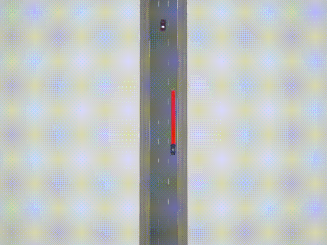

# 测试场景集说明

选取参考中关村智能交通产业联盟的团体标准T/CMAX21002-2020《自动驾驶仿真测试场景要求》(以下简称团体标准，网址http://www.ttbz.org.cn/StandardManage/Detail/38842/ )，选取了其中典型的3类换道逻辑场景(逻辑场景1、2、3)，并补充了两类逻辑场景(逻辑场景4、5)，通过参数实例化获得400余例具体测试场景。由算法控制换道的车辆称为测试车辆，其他环境车辆称为目标车辆。

逻辑场景描述如下：

## (1) 直行遇本车道目标车辆

<div align="center">


</div>

<p align="center">图1 逻辑场景1示例</p>

测试车辆以目标速度$V_1$在直线道路上行驶，测试车辆左侧车道线为虚线，右侧车道线为实线，车道宽度为$X_0$。测试车辆前方放置以目标速度$V_2$行驶的目标车辆，测试车辆与目标车辆中心线均与车道中心线重合，两车初始纵向距离大于$100$ m。

相关参数信息设置：

$V_1=60$ km/h

$V_2=[0.0:5.0:45.0]$ km/h

$X_0=3.5$ m

 

## (2) 直行遇本车道目标车辆

<div align="center">


</div>

<p align="center">图2 逻辑场景2示例</p>

测试车辆以目标速度$V_1$在直线道路上行驶，测试车辆左侧车道线为虚线，右侧车道线为实线，车道宽度为$X_0$。测试车辆前方放置静止目标车辆，测试车辆与目标车辆$TV_1$初始纵向距离大于$100$ m；测试车辆左侧相邻车道后方放置以速度$V_2$行驶的目标车辆$TV_2$、其与测试车辆初始纵向距离为$d$。

相关参数信息设置：

$V_1=60$ km/h

$V_2=[30.0:5.0:50.0]$ km/h

$d=[50:10.0:100]$ m

$X_0=3.5$ m

 

## (3) 三车道直行换道遇目标车道目标车辆

<div align="center">
/>

</div>

<p align="center">图3 逻辑场景3示例</p>

测试车辆以目标速度$V_1$在三车道直线道路上行驶，测试车辆左侧车道线为虚线，右侧车道线为虚线，车道宽度为$X_0$。测试车辆前方放置以速度$V_2$沿车道中心线行驶的目标车辆$TV_1$，测试车辆与目标车辆$TV_1$之间纵向距离为$D$。测试车辆左侧相邻车道放置以速度$V_3$沿车道中心线行驶的目标车辆$TV_2$，目标车辆$TV_1$与目标车辆$TV_2$之间纵向距离为$d$。

相关参数信息设置：

$V_1=60$ km/h

$V_2=[25.0:10.0:45.0]$ km/h

$V_3=[5.0:10.0:65.0]$ km/h

$d=[-100.0:20.0:100.0]$ m

$D=100.0$ m

$X_0=3.5$ m

 

## (4) 三车道直行遇前方低速车辆且相邻车道前方有车辆

<div align="center">


</div>

<p align="center">图4 逻辑场景4示例</p>

测试车辆以目标速度$V_1$在三车道直线道路右侧车道上行驶，测试车辆右侧为实线车道线，左侧为虚线车道线，车道宽度为$X_0$。测试车辆前方放置以目标速度$V_2$行驶的目标车辆$TV_1$，$V_2<V_1$，测试车辆与目标车辆$TV_1$之间纵向距离为$D$。测试车辆左侧车道前方放置以目标速度$V_3$行驶的目标车辆$TV_2$，目标车辆$TV_1$与目标车辆$TV_2$之间纵向距离为$d$。

相关参数信息设置：

$V_1=60$ km/h

$V_2=[25.0:10.0:45.0]$ km/h

$V_3=[5.0:10.0:65.0]$ km/h

$d=[50.0:10.0:100.0]$ m

$D=100.0$ m

$X_0=3.5$ m

 

## (5) 直行遇前车切出后有慢速车辆

<div align="center">


</div>

<p align="center">图5 逻辑场景5示例</p>

测试车辆以目标速度$V_1$在直线道路上行驶，测试车辆左侧为虚线车道线，右侧为实线车道线，车道宽度为$X_0$。测试车辆前方放置以目标速度$V_2$沿车道中心行驶的目标车辆$TV_1$，目标车辆$TV_1$前方放置静止目标车辆$TV_2$，$V_2<V_1$。目标车辆$TV_1$与目标车辆$TV_2$初始纵向距离为$d$。测试车辆与目标车辆$TV_1$之间的纵向距离为$D$时，目标车辆$TV_1$保持速度不变，向测试车辆左车道变道，目标车辆$TV_1$完成变道后，测试前方出现静止车辆$TV_2$。

相关参数信息设置：

$V_1=60$ km/h

$V_2=[30.0:5.0:50.0]$ km/h

$d=[140.0:10.0:180.0]$ m

$D=100.0$ m

$X_0=3.5$ m

 

注：

车辆速度参数$V$范围为$30.0$ km/h-$50.0$ km/h，参数$V$赋值的步长选取$5.0$ km/h，可以通过$V=[30:5.0:50.0]$ km/h表达式进行描述；如果参数的赋值方式非均匀分布，例如测试场景中车辆的速度参数$V$的赋值为$25.0$ km/h、$40.0$ km/h和$50.0$ km/h三个值的任意值，可以通过$V=[25.0,40.0,50.0]$ km/h表达式进行描述。


# 环境配置说明

1. 下载[CARLA 0.9.9.4](https://github.com/carla-simulator/carla/releases/tag/0.9.9)版本并解压

2. 克隆当前repo

3. 将map_package文件夹拷贝至CARLA_0.9.9.4/CarlaUE4/Content/文件夹下

4. 将scenario_runner文件夹拷贝至CARLA_0.9.9.4/文件夹下

5. 设置CARLA环境变量，将其添加至.bashrc中（注意修改相应路径）：

   ```
   export CARLA_VERSION=0.9.9.4
   export CARLA_ROOT=/your_path_to/CARLA_${CARLA_VERSION}
   export SCENARIO_RUNNER_ROOT=${CARLA_ROOT}/scenario_runner
   export PYTHONPATH=$PYTHONPATH:${CARLA_ROOT}/PythonAPI/carla/dist/carla-0.9.9-py3.7-linux-x86_64.egg:${CARLA_ROOT}/PythonAPI/carla/agents:${CARLA_ROOT}/PythonAPI/carla:${SCENARIO_RUNNER_ROOT}
   ```

6. 利用conda安装虚拟环境：

   ```
   conda env create -f carla_test.yaml
   ```


# 代码使用说明

测试场景代码主要在`CarlaHighwayTestEnv.py`文件中，已封装为gym接口。主车的规划控制部分代码参考了[链接](https://github.com/paulyehtw/Motion-Planning-on-CARLA)。`test_demo/test.py`文件提供了一个场景代码使用范例，并且包含基于D3QN算法训练出的权重，可直接在上述conda创建的虚拟环境中运行，该权重下所有场景的测试结果在文件夹`test_demo/logdir`中。测试样例使用步骤为：

1. 打开终端1，依次运行

   ```
   cd $CARLA_ROOT
   ./CarlaUE4.sh -carla-rpc-port=2000
   ```

2. 打开终端2，依次运行

   ```
   conda activate carla_test
   cd your_path_to/test_demo
   python test.py --logdir='./logdir' --port=2000 --record=True
   ```


测试过程会产生`test_result.jsonl`、`collision.jsonl`、`fail.jsonl`和`exceed_acc.jsonl`等文件，分别对应所有场景的测试结果、发生碰撞的场景、换道失败的场景（场景结束时车辆所在车道与初始车道相同）、超加速度场景（场景中存在加速度超过2 m/s^2 的时刻）。另外测试过程会产生`carla_log/`文件夹，记录了每个场景的CARLA recorder和场景测试过程中的速度、加速度等信息。
